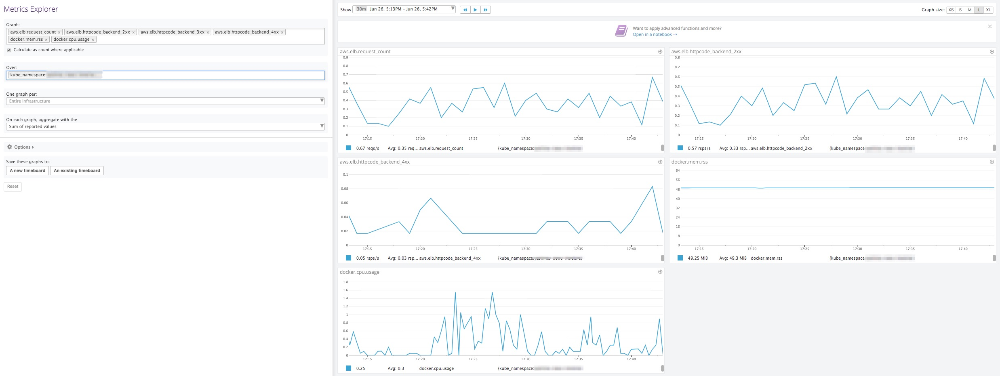
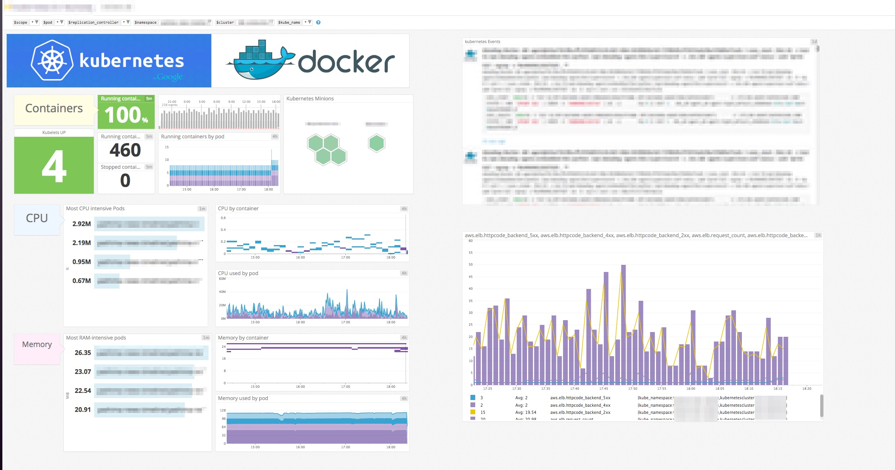
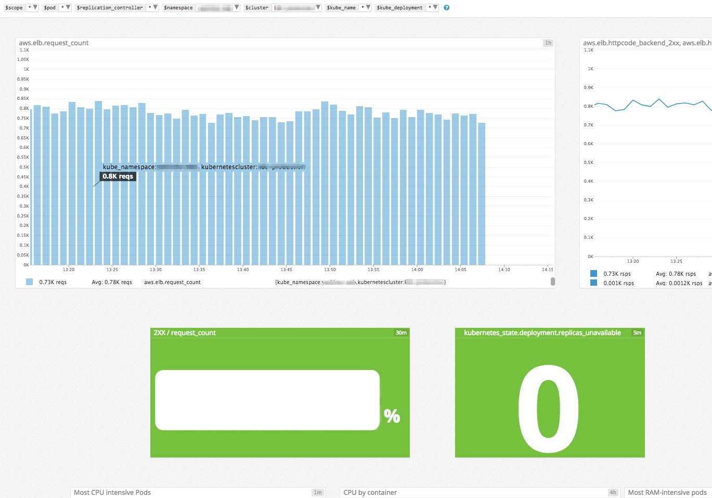

# sltd

[](https://travis-ci.org/koudaiii/sltd)
[](https://quay.io/repository/koudaiii/sltd)
[](https://github.com/koudaiii/sltd/releases)

Tag ELB from service label in kubernetes cluster for Datadog monitoring.
Service Label to Tag by Daemon = sltd

- `kube_namespace` filter in Metrics Explorer



- Kubernetes with ELB requests and status in Dashboard



- Dashboard with 2XX / request_count



```
"q": "100 * sum:aws.elb.httpcode_backend_2xx{$pod,$replication_controller,$namespace,$cluster,$scope,$kube_name,$kube_deployment}.as_count() / sum:aws.elb.request_count{$pod,$replication_controller,$namespace,$cluster,$scope,$kube_name,$kube_deployment}.as_count()"
```

Table of Contents
=================

   * [sltd](#sltd)
      * [Table of Contents](#table-of-contents)
      * [Requirements](#requirements)
      * [Installation](#installation)
         * [Using Homebrew (OS X only)](#using-homebrew-os-x-only)
         * [Precompiled binary](#precompiled-binary)
         * [From source](#from-source)
         * [Run in a Docker container](#run-in-a-docker-container)
      * [Usage](#usage)
         * [kubeconfig file](#kubeconfig-file)
         * [Options](#options)
      * [Development](#development)
      * [Deployment Guide](#deployment-guide)
         * [Kubernetes](#kubernetes)
      * [Author](#author)
      * [License](#license)

Created by [gh-md-toc](https://github.com/ekalinin/github-markdown-toc)

## Requirements

* Kubernetes 1.3 or later
* AWS Credentials keys (need DescribeTags, AddTags, RemoveTags)

## Installation

### Using Homebrew (OS X only)

Formula is available at [koudaiii/homebrew-tools](https://github.com/koudaiii/homebrew-tools).

```bash
$ brew tap koudaiii/tools
$ brew install sltd
```

### Precompiled binary

Precompiled binaries for Windows, OS X, Linux are available at [Releases](https://github.com/koudaiii/sltd/releases).

### From source

```bash
$ go get -d github.com/koudaiii/sltd
$ cd $GOPATH/src/github.com/koudaiii/sltd
$ make deps
$ make install
```

### Run in a Docker container

docker image is available at [quay.io/koudaiii/sltd](https://quay.io/repository/koudaiii/sltd).

```bash
# -t is required to colorize logs
$ docker run \
    --rm \
    -t \
    -e AWS_ACCESS_KEY_ID="XXXXXXX" \
    -e AWS_SECRET_ACCESS_KEY="XXXX" \
    -e AWS_DEFAULT_REGION="ap-northeast-1" \
    -e AWS_REGION="ap-northeast-1" \
    -v $HOME/.kube/config:/.kube/config \
    quay.io/koudaiii/sltd:latest \
    --in-cluster=false
```

## Usage

* `sltd` make tag ELB from labels in kubernetes cluster.
  * cluster name is `kubernetescluster` key
  * namespace is `kube_namespace` key
  * service name is `kube_name` key

* `--onetime` option

```bash
$ sltd --onetime
```

* `--sync-interval` option
```bash
$ sltd  --sync-interval=10s
```

### kubeconfig file

if `sltd` uses out of cluster, `~/.kube/config` as default.

### Options

|Option|Description|Required|Default|
|---------|-----------|-------|-------|
|`--onetime=bool` | run one time and exit.|optional|false|
|`--in-cluster=bool`| if `sltd` uses out of cluster,need `--in-cluster=false`|optional|true|
|`--sync-interval=string`|the time duration between template processing.|optional|60s|
|`-h`, `-help`|Print command line usage|||
|`-v`, `-version`|Print version|||

## Development

Clone this repository and build using `make`.

```bash
$ go get -d github.com/koudaiii/sltd
$ cd $GOPATH/src/github.com/koudaiii/sltd
$ make
```

## Deployment Guide

### Kubernetes

```yaml
      containers:
      - image: "quay.io/koudaiii/sltd:latest"
        name: sltd
          resources:
            requests:
              cpu: 100m
              memory: 30Mi
          command:
            - "/sltd"
          args:
            - "--sync-interval=60s"
        env:
        - name: AWS_DEFAULT_REGION
          value: "ap-northeast-1"
        - name: AWS_REGION
          value: "ap-northeast-1"
        - name: AWS_ACCESS_KEY_ID
          valueFrom:
            secretKeyRef:
              name: dotenv
              key: aws-access-key-id
        - name: AWS_SECRET_ACCESS_KEY
          valueFrom:
            secretKeyRef:
              name: dotenv
              key: aws-secret-access-key
```

## Author

[@koudaiii](https://github.com/koudaiii)

## License

[](LICENSE)
